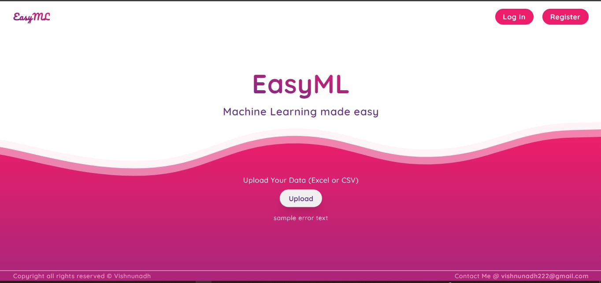

# Easy ML : Machine Learning Made Easy!

Machine Learning is great! and often time we Data scientists build machine learning models using python by following various data science pipelines such as exploratory data analysis, data visualisation, feature engineering, hyper parameter tuning and model training etc. This Full stack application is a humble attempt to make the machine learning model building easier and faster. The uploaded data can be visualised for Exploratory data analysis, data processing and feature engineering can be done according to users descretion, model building can be done by user defined parameter for the algorithm choosen. Using the authentication the user will be able to save the work and download the trained model file, and so more.

The application is a work under progress which started from auguest 2022, and will be build by keeping scalability in mind to add more features in the future. (Presently deep learning is not planning to incorporate)

## Demo



## Tech Stack

- **Client:** HTML5, Sass, JavaScript, D3.JS ,React.JS, React Router v.6, Redux Toolkit.

- **Server:** Python with all machine learning libraries : Numpy, Pandas, Plotly, Sklearn etc

- **REST API Framework:** Python Flask==2.0.2

<!-- ## Deployed Link -->

<!-- This project is deployed in the cloud service of Heroku using docker and Circle CI to establish countinous intergration and continous development. The retraining feature is removed from deployed version of app inorder to stay within the heroku free tier limit service. -->

<!-- - App link : [Concrete_strength_predictor](https://concrete-strength-prediction11.herokuapp.com/) -->

<!-- ## Run App Locally -->

<!-- To run the App locally python version 3.6 or higher should be installed in your computer -->

<!-- Clone the project -->

<!-- Go to the project directory you want to clone the project files

```bash
  cd your-project-directory
```

```bash
  git clone https://github.com/Vishnu-Nadh/Concrete_strength_prediction.git
```

To Avail the retraining feature button go to base.html file, find button with class "train-btn"
and remove the inline style : style="display: none".

Install dependencies

Choose your python environment to install dependencies and install the libaries using below commant in terminal

```bash
  pip install -r requirements.txt
```

Start the server.
You can either run main.py file or type the below command in terminal

```bash
    python main.py
``` -->

<!-- Press Enter. The app will be running in localhost port number 5000 : http://localhost:5000/. Use csv data from the folder "Prediction_Input" to test the app -->

## Reflection

- Will be updated

## 🚀 About Me

- 📈I'm a Data scientist...
- 🖥Full stack python developer..
- 💻Tech enthusiast..
- 📖Avid learner..

## 🔗 Links

[](https://www.linkedin.com/in/vishnunadh/)
